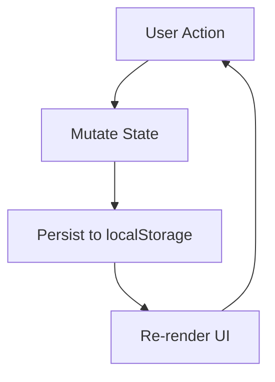

# Design Document: Expense & Budget Visualizer

## Overview

A single-page web application (SPA) built with plain HTML, CSS, and Vanilla JavaScript. It lets users record spending transactions, view a running balance, browse a sortable transaction history, and visualise category spending via a Chart.js pie chart. All state is persisted to `localStorage`; there is no backend, no build step, and no framework dependency.

The entire application ships as three files:

```
index.html
css/styles.css
js/app.js
```

Chart.js is loaded from a CDN `<script>` tag in `index.html`.

---

## Architecture

The app follows a simple **state → render** loop:



All mutable state lives in a single in-memory object (`AppState`). Every user action (add transaction, delete transaction, add category, change sort) mutates that object, flushes it to `localStorage`, then calls a top-level `render()` function that repaints every UI region.

There are no reactive frameworks; DOM updates are done by replacing `innerHTML` of well-defined container elements.

### Module Boundaries (within `js/app.js`)

| Concern | Responsibility |
|---|---|
| `storage` | Read/write `localStorage` |
| `state` | In-memory `AppState` object + mutation helpers |
| `validation` | Form field validation rules |
| `chart` | Chart.js wrapper (create / update / destroy) |
| `render` | DOM rendering functions for each UI region |
| `handlers` | Event listener callbacks wired to DOM events |
| `init` | Bootstrap: load state, wire events, initial render |

All concerns live in the same file but are organised as plain functions with clear naming conventions (`storage_*`, `render_*`, etc.).

---

## Components and Interfaces

### HTML Structure

```
<body>
  #balance-display          ← Requirement 4
  #input-form               ← Requirement 1
  #category-manager         ← Requirement 9
  #sort-control             ← Requirement 11
  #transaction-list         ← Requirement 2 / 3
  #chart-container          ← Requirement 5
  #monthly-summary          ← Requirement 10
</body>
```

### Input Form (`#input-form`)

Fields: `input[name=item]` (text), `input[name=amount]` (number, min=0.01, step=0.01), `select[name=category]`.

Emits: `submit` event → `handlers.addTransaction()`.

### Category Manager (`#category-manager`)

Fields: `input[name=custom-category]` (text), `button` (Add).

Emits: `click` → `handlers.addCategory()`.

### Sort Control (`#sort-control`)

A `<select>` with four options: `date-desc` (default), `amount-asc`, `amount-desc`, `category-asc`.

Emits: `change` → `handlers.changeSort()`.

### Transaction List (`#transaction-list`)

Rendered as a `<ul>`. Each `<li>` contains item name, amount, category badge, and a delete `<button data-id>`.

Emits: `click` on delete button → `handlers.deleteTransaction(id)`.

### Chart Container (`#chart-container`)

Contains a `<canvas id="spending-chart">`. Managed entirely by the `chart` module. Shows a placeholder `<p>` when no transactions exist.

### Monthly Summary (`#monthly-summary`)

Rendered as a `<ul>` of month rows. Shows placeholder when empty.

---

## Data Models

### `AppState`

```js
{
  transactions: Transaction[],   // ordered by insertion (newest first)
  categories: string[],          // default + custom, insertion order
  sortOption: SortOption         // persisted user preference
}
```

### `Transaction`

```js
{
  id: string,        // crypto.randomUUID() or Date.now().toString() fallback
  name: string,      // item name, trimmed, non-empty
  amount: number,    // positive float, stored as number
  category: string,  // must match an entry in AppState.categories
  createdAt: number  // Date.now() timestamp (ms since epoch)
}
```

### `SortOption`

```js
type SortOption = 'date-desc' | 'amount-asc' | 'amount-desc' | 'category-asc'
```

### `localStorage` Keys

| Key | Value |
|---|---|
| `ebv_transactions` | `JSON.stringify(Transaction[])` |
| `ebv_categories` | `JSON.stringify(string[])` |
| `ebv_sort` | `SortOption` string |

Default categories (`['Food', 'Transport', 'Fun']`) are merged with any persisted custom categories on init; they are never written to `ebv_categories` themselves — only custom additions are stored there.

### Derived Values (computed at render time, never stored)

- **Balance**: `transactions.reduce((sum, t) => sum + t.amount, 0)`
- **Chart data**: group transactions by category, sum amounts per group
- **Monthly summary**: group transactions by `YYYY-MM` key derived from `createdAt`, sum per group, sort descending

---

## Correctness Properties

*A property is a characteristic or behavior that should hold true across all valid executions of a system — essentially, a formal statement about what the system should do. Properties serve as the bridge between human-readable specifications and machine-verifiable correctness guarantees.*

### Property 1: Valid transaction is persisted and retrievable

*For any* valid transaction (non-empty name, positive amount, known category), after it is added, reading `ebv_transactions` from `localStorage` and parsing it should yield an array that contains a transaction with the same name, amount, and category.

**Validates: Requirements 1.4, 6.1**

---

### Property 2: Invalid transactions are rejected

*For any* form submission where the item name is empty, the amount is zero or negative, or no category is selected, the transaction list should remain unchanged and `localStorage` should not be updated.

**Validates: Requirements 1.2, 1.3**

---

### Property 3: Balance equals sum of all transaction amounts

*For any* sequence of add and delete operations, the displayed Balance should always equal the arithmetic sum of the `amount` fields of all currently stored transactions.

**Validates: Requirements 4.1, 4.2, 4.3**

---

### Property 4: Transaction list serialisation round-trip

*For any* array of transactions, serialising it to JSON and deserialising it should produce an array of transactions that is structurally equal to the original (same ids, names, amounts, categories, timestamps).

**Validates: Requirements 6.1, 6.2, 6.3**

---

### Property 5: Delete removes exactly one transaction

*For any* transaction list containing a transaction with a given id, deleting that id should produce a list that is exactly one element shorter and contains no transaction with that id.

**Validates: Requirements 3.2, 3.3**

---

### Property 6: Sort order invariant

*For any* transaction list and any sort option, applying the sort should produce a list where every adjacent pair of elements satisfies the sort comparator for that option.

**Validates: Requirements 11.1, 11.2, 11.3**

---

### Property 7: Sort preference round-trip

*For any* sort option value, writing it to `localStorage` and reading it back should return the same value.

**Validates: Requirements 11.4**

---

### Property 8: Custom category duplicate rejection

*For any* existing category list and any new category name that matches an existing name (case-insensitive), the add-category operation should leave the category list unchanged.

**Validates: Requirements 9.2, 9.3**

---

### Property 9: Custom category persisted and restored

*For any* custom category name that passes validation, after it is added, reading `ebv_categories` from `localStorage` and parsing it should yield an array that includes that category name.

**Validates: Requirements 9.4, 9.5**

---

### Property 10: Monthly summary totals are consistent with transactions

*For any* transaction list, the sum of all monthly totals in the Monthly_Summary should equal the overall Balance.

**Validates: Requirements 10.1, 10.2, 10.3**

---

### Property 11: Chart data totals are consistent with transactions

*For any* transaction list, the sum of all per-category values used to render the Chart should equal the overall Balance.

**Validates: Requirements 5.1, 5.2, 5.3**

---

## Error Handling

| Scenario | Handling |
|---|---|
| `localStorage` unavailable (private browsing, quota exceeded) | Wrap all storage calls in `try/catch`; app continues in-memory only, no crash |
| `localStorage` contains malformed JSON | `JSON.parse` wrapped in `try/catch`; fall back to empty state |
| Chart.js CDN fails to load | `window.Chart` guard before instantiation; show static text fallback |
| `crypto.randomUUID` unavailable (old Safari) | Fall back to `Date.now().toString() + Math.random()` |
| Amount field receives non-numeric input | HTML `type=number` + Validator rejects; inline error shown |
| Duplicate custom category | Validator rejects; inline error shown; list unchanged |

---

## Testing Strategy

### Unit Tests

Focus on pure functions that have no DOM or `localStorage` dependency:

- `validation.validateTransaction(fields)` — test all invalid permutations (empty name, zero amount, negative amount, missing category) and the valid case
- `validation.validateCategory(name, existing)` — test empty string, duplicate (case-insensitive), and valid new name
- `state.computeBalance(transactions)` — test empty array, single item, multiple items
- `state.sortTransactions(transactions, option)` — test each of the four sort options with a fixed dataset
- `state.groupByMonth(transactions)` — test empty array, single month, multiple months, descending order
- `state.groupByCategory(transactions)` — test empty array, single category, multiple categories
- `storage.parseTransactions(json)` — test valid JSON, malformed JSON, empty string, null

### Property-Based Tests

Use a property-based testing library (e.g. **fast-check** for JavaScript, loadable via CDN or npm for test-only use).

Each property test runs a minimum of **100 iterations**.

Each test is tagged with a comment in the format:
`// Feature: expense-budget-visualizer, Property N: <property text>`

| Property | Test description |
|---|---|
| P1 | Generate random valid transactions, add each, assert localStorage contains them |
| P2 | Generate invalid field combinations, assert list length unchanged |
| P3 | Generate random add/delete sequences, assert balance === sum of amounts |
| P4 | Generate random Transaction arrays, assert JSON round-trip equality |
| P5 | Generate random lists + random target id, delete it, assert length-1 and id absent |
| P6 | Generate random transaction lists, apply each sort option, assert pairwise comparator holds |
| P7 | Generate random SortOption values, write/read localStorage, assert equality |
| P8 | Generate random category lists + duplicate name (varied casing), assert list unchanged |
| P9 | Generate random valid category names, add each, assert localStorage contains them |
| P10 | Generate random transaction lists, assert sum of monthly totals === balance |
| P11 | Generate random transaction lists, assert sum of chart category values === balance |
